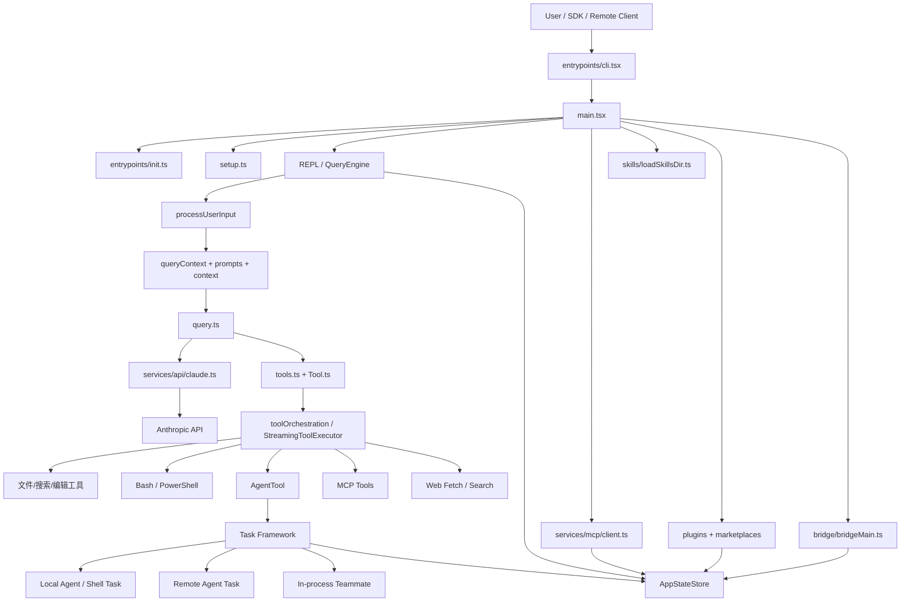
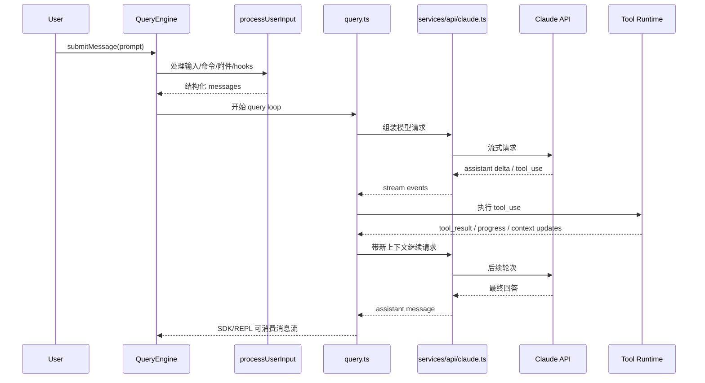

# ClaudeCode 架构分析与设计文档

## 文档信息

- 分析对象: `https://github.com/ixxmi/ClaudeCode`
- 分析快照: `be73d8e`
- 分析时间: `2026-04-01`
- 分析方式: 静态代码逆向分析
- 重要说明: 该仓库当前更像一份源码镜像，而不是可直接构建运行的标准开源项目。根目录缺少 `package.json`、`README`、锁文件和构建脚本，因此本文重点是“架构设计还原”，不是“部署手册”。

## 1. 总体判断

从代码结构判断，这不是一个单纯的命令行工具，而是一套完整的 Agent Runtime 平台，核心能力包括：

- 终端交互式 CLI / REPL
- Headless/SDK 模式会话执行
- 工具调用与权限治理
- 多代理与后台任务编排
- MCP Client 与 MCP Server 双向集成
- 远程会话、桥接控制与云端后台执行
- Skills、Plugins、动态命令扩展
- 长会话上下文压缩、缓存、恢复与遥测

如果用一句话概括，这个项目本质上是一个“面向编码场景的代理操作系统”，而不只是一个“会调用 LLM 的 CLI”。

## 2. 推断出的设计目标

从入口文件、延迟加载和大量 feature gate 的写法看，这个系统的设计目标非常明确：

1. 启动快
   - `entrypoints/cli.tsx` 先走轻量分流，很多路径只做极少导入。
   - `main.tsx` 在顶层预取 keychain、MDM 配置和 profiler，明显在压缩冷启动。

2. 同一套内核支撑多种运行形态
   - 交互式 REPL
   - 非交互 SDK
   - MCP server
   - 远程 viewer / remote control / bridge

3. 工具调用必须可治理
   - 工具并不是直接暴露给模型，而是被权限系统、规则、hook、sandbox、classifier 多层包裹。

4. 长时间运行与后台化是第一等能力
   - Agent、Shell、Remote session、Teammate 都被抽象成统一 `Task`。

5. 扩展性要强
   - Command、Tool、Skill、Plugin、MCP server 都是可插拔结构。

6. 内外部版本可裁剪
   - 项目广泛使用 `bun:bundle` 的 `feature(...)` 做编译期裁剪，说明同一代码库会产出不同能力集的发行版本。

## 3. 模块分层

| 层级 | 代表文件 | 职责 |
| --- | --- | --- |
| 入口层 | `entrypoints/cli.tsx`, `main.tsx`, `setup.ts`, `entrypoints/init.ts` | CLI 分流、初始化、环境探测、全局配置加载 |
| 会话与查询层 | `QueryEngine.ts`, `query.ts`, `utils/processUserInput/processUserInput.ts`, `utils/queryContext.ts` | 用户输入转消息、系统提示组装、LLM 流式循环、工具回填 |
| API 适配层 | `services/api/claude.ts` | 把内部消息、工具和模型配置转换为 API 请求与流响应 |
| 工具体系 | `Tool.ts`, `tools.ts`, `services/tools/*`, `tools/*` | 工具定义、注册、权限检查、串并行调度、UI 呈现 |
| 命令体系 | `commands.ts`, `commands/*` | Slash command 注册、命令执行与命令型 prompt 构造 |
| 任务与多代理 | `Task.ts`, `tasks.ts`, `tasks/*`, `tools/AgentTool/*` | 后台任务、子代理、远程代理、队友代理、输出追踪 |
| 扩展体系 | `skills/loadSkillsDir.ts`, `services/plugins/*`, `plugins/*` | Skills、Plugin、Marketplace、动态命令 |
| MCP 集成 | `services/mcp/*`, `entrypoints/mcp.ts` | 外接 MCP server、暴露内部工具为 MCP server |
| 远程与桥接 | `remote/*`, `bridge/*`, `utils/teleport*` | 云端会话、远程控制、bridge 环境、后台远程任务 |
| 状态与 UI | `state/AppStateStore.ts`, `screens/*`, `components/*`, `ink/*` | AppState、Ink UI、通知、任务面板、权限对话 |
| 安全治理 | `utils/permissions/*`, `tools/BashTool/*`, `utils/sandbox/*`, `services/policyLimits/*` | 规则、审批、策略、沙箱、危险命令识别 |

## 4. 顶层架构图

## 5. 启动链路

### 5.1 轻量入口分流

`entrypoints/cli.tsx` 的作用不是“真正运行主程序”，而是“先判断是否可以走快路径”。

它优先处理以下场景：

- `--version`
- dump system prompt
- 内置 MCP server 启动
- daemon worker
- bridge / remote-control
- 后台 session 管理
- 模板任务类命令

只有进入完整交互路径时，才会进一步进入 `main.tsx`。这说明该系统高度重视冷启动延迟，特别是把“大模块导入”和“轻量命令执行”分开。

### 5.2 全局初始化

`entrypoints/init.ts` 负责初始化过程中的基础设施：

- 启用配置系统
- 应用安全的环境变量
- 配置 CA 证书、mTLS、代理与全局 HTTP agent
- 启动 telemetry、GrowthBook、1P logging
- 异步探测 IDE、GitHub 仓库、远程托管设置
- 初始化 scratchpad、LSP manager 清理钩子
- 预连接 API 以减少首包延迟

这一层本质上是“运行时基座初始化”。

### 5.3 会话 setup

`setup.ts` 更接近“本次会话初始化”而不是“进程级初始化”，包括：

- 校验 Node 版本
- 切换 session id
- 启动 UDS messaging
- 捕获 teammate 快照
- 恢复 Terminal/iTerm 备份
- 设置 cwd
- 捕获 hook 配置快照
- 初始化文件变化 watcher
- 处理 worktree 与 tmux 模式

也就是说，`init.ts` 解决“程序能跑”，`setup.ts` 解决“当前会话如何跑”。

## 6. 核心执行模型

### 6.1 QueryEngine 是会话内核

`QueryEngine.ts` 提供了一个面向单会话的执行引擎，它维护：

- 当前消息历史
- 文件读取缓存
- 权限拒绝状态
- 累计 usage
- 当前 abort controller
- 发现过的 skills / nested memories

这里的设计重点是：**一个 QueryEngine 对应一个会话，多次 `submitMessage()` 是同一会话上的多轮交互**。

这使它既能服务 REPL，也能服务 SDK/headless 场景。

### 6.2 输入处理不是直接发给模型

`processUserInput.ts` 会把用户输入先转换成内部消息结构，并做多层预处理：

- slash command 解析
- 图片、附件、IDE 选择区注入
- pasted content 展开
- hook 执行
- meta message 与 bridge message 的特殊处理

这说明系统不是“字符串 in -> 字符串 out”，而是“用户意图 -> 结构化消息事件流”。

### 6.3 系统提示由多部分拼装

`utils/queryContext.ts` 负责组装 API cache-key 前缀所需的三部分：

- `defaultSystemPrompt`
- `userContext`
- `systemContext`

再叠加：

- custom system prompt
- append system prompt
- agent 专属 prompt
- memory / coordinator / mode 特定补充

这意味着 system prompt 不是静态常量，而是按运行场景动态拼装的“上下文产物”。

### 6.4 query.ts 是真正的对话循环

`query.ts` 是整个系统最关键的运行时循环，负责：

- 把当前消息与系统上下文发给模型
- 流式接收 assistant message
- 识别 `tool_use`
- 触发工具执行
- 把 `tool_result` 再补回消息流
- 根据 stop reason、预算、恢复策略决定是否继续下一轮

它还内建了很多长会话能力：

- token budget 跟踪
- auto compact
- reactive compact
- max output tokens 恢复
- fallback model
- tool use summary
- stop hooks

从架构角度看，`query.ts` 是“代理状态机”，而 `services/api/claude.ts` 只是“模型通信适配器”。

## 7. 主时序图

## 8. 工具体系设计

### 8.1 Tool 是统一能力契约

`Tool.ts` 定义了工具运行时的核心契约。一个工具通常具备以下能力：

- `name`
- `prompt()`
- `inputSchema`
- `outputSchema`
- `call()`
- `validateInput()`
- `isEnabled()`
- `isConcurrencySafe()`
- `interruptBehavior()`

同时，`ToolUseContext` 里承载了几乎所有运行时依赖：

- 当前工具列表
- 命令列表
- MCP clients / resources
- AppState 读写
- 文件缓存
- abort controller
- 消息历史
- UI 回调
- 任务状态更新函数

这意味着工具不是简单的“纯函数”，而是运行在一个受控的 Agent Runtime 中。

### 8.2 tools.ts 是能力注册中心

`tools.ts` 通过集中注册构建工具全集，再按环境裁剪：

- 基础工具: 读、写、编辑、搜索、Web、Todo
- 计划/模式工具: `EnterPlanMode`, `ExitPlanMode`
- 任务工具: `TaskCreate`, `TaskGet`, `TaskUpdate`, `TaskStop`
- 代理工具: `AgentTool`, `SendMessageTool`, `TeamCreateTool`
- MCP 相关工具
- feature gate 下的实验性工具

它还做两件重要的事情：

1. 按 feature gate / env / build 类型做裁剪
2. 按权限上下文做预过滤

因此，模型看到的工具集合本身就是“环境 + 权限 + 构建类型”的结果。

### 8.3 工具编排支持串并行混合执行

`services/tools/toolOrchestration.ts` 的策略是：

- 并发安全工具可分批并行
- 非并发安全工具串行执行
- 上下文修改先收集，按顺序回放

`StreamingToolExecutor.ts` 进一步支持边流式接收 `tool_use` 边执行，并解决几个问题：

- 保持结果输出顺序
- 并发安全工具并行
- 非并发安全工具独占
- 某个 Bash 失败时中止兄弟工具
- streaming fallback 时丢弃失效结果

这一套设计说明作者非常在意“模型连续输出工具调用”时的吞吐和一致性。

## 9. 命令、Skill、Plugin 三套扩展机制

### 9.1 命令体系

`commands.ts` 是 slash command 注册中心，内置了大量命令，例如：

- `/review`
- `/mcp`
- `/skills`
- `/tasks`
- `/permissions`
- `/plan`
- `/remote-control`
- `/teleport`

命令本身有几种形态：

- 纯 prompt 型
- 本地 JSX / UI 型
- 非交互型

命令不是工具的别名，而是用户交互入口层的一部分。

### 9.2 Skill 体系

`skills/loadSkillsDir.ts` 显示 Skills 是高度工程化的扩展机制，而不是简单读一个 `SKILL.md`。

它支持从多个来源加载：

- user settings
- project settings
- policy settings
- bundled
- plugin
- mcp

Skill frontmatter 支持的信息很丰富：

- `description`
- `when_to_use`
- `allowed-tools`
- `arguments`
- `model`
- `effort`
- `hooks`
- `context: fork`
- `agent`
- `user-invocable`

这意味着 Skill 不只是文档片段，而是“可带执行约束、模型偏好和上下文策略的 prompt 扩展单元”。

### 9.3 Plugin 体系

Plugin 体系与 Skill 不同，它更偏向运行时能力扩展与 marketplace 分发。

`services/plugins/PluginInstallationManager.ts` 说明插件支持：

- 后台安装 marketplace
- 安装状态回写 AppState
- 新装后自动 refresh
- 更新后标记 `needsRefresh`

所以 Plugin 面向的是“能力分发和版本化”，Skill 面向的是“知识和流程注入”。

## 10. 任务系统与多代理系统

### 10.1 Task 是统一后台执行抽象

`Task.ts` 把不同后台执行形态统一成一个抽象，当前可见的类型包括：

- `local_bash`
- `local_agent`
- `remote_agent`
- `in_process_teammate`
- `local_workflow`
- `monitor_mcp`
- `dream`

统一字段包括：

- `id`
- `type`
- `status`
- `description`
- `outputFile`
- `startTime/endTime`
- `toolUseId`

这使 UI、通知、持久化和恢复都可以围绕同一个任务模型展开。

### 10.2 AgentTool 是多代理系统入口

`tools/AgentTool/AgentTool.tsx` 是整个多代理系统的核心入口。它支持：

- 启动内置代理或自定义代理
- 指定子代理模型
- 前台/后台运行
- worktree 隔离
- remote 隔离
- teammate/team 语义
- named agent 路由

它不是简单地“递归调用自己”，而是和任务系统深度耦合：

- 本地 agent -> `LocalAgentTask`
- 远程 agent -> `RemoteAgentTask`
- 进程内 teammate -> `InProcessTeammateTask`

### 10.3 本地后台 Agent

`tasks/LocalAgentTask/LocalAgentTask.tsx` 负责：

- agent 进度追踪
- transcript/output 持久化
- 完成/失败通知
- foreground/background 切换
- task panel 展示

它会记录最近工具活动、token 使用和结果摘要，说明后台 agent 不是黑盒，而是可观测对象。

### 10.4 后台 Shell 任务

`tasks/LocalShellTask/LocalShellTask.tsx` 负责后台 Bash 任务，并且内置了一个非常实用的能力：

- watchdog 检查输出是否卡在交互式提示上

这说明系统已经踩过很多“模型启动后台命令，但命令在等用户输入”这类真实工程问题。

### 10.5 进程内 Teammate

`tasks/InProcessTeammateTask/InProcessTeammateTask.tsx` 表明系统还支持一种比 background agent 更轻的协作模型：

- 在同一 Node 进程内运行
- 有团队身份
- 支持 pending message 注入
- 支持 plan mode 审批

这更像是“同进程多角色协作”，而不是“完整隔离子进程”。

## 11. MCP 架构

### 11.1 外接 MCP Server

`services/mcp/client.ts` 是 MCP client 总控层，支持的 transport 包括：

- stdio
- SSE
- streamable HTTP
- WebSocket
- SDK control transport

它处理的不是简单 RPC，而是一整套运行问题：

- 连接建立与重连
- OAuth / 鉴权
- session 过期
- elicitation
- 输出截断与持久化
- MCP tools/resources/prompts 的内部映射

这说明 MCP 在该系统里不是“外挂”，而是与内建工具平级的一等公民。

### 11.2 对外暴露内部工具

`entrypoints/mcp.ts` 又把内部 Tool 体系反向暴露成一个 MCP server。

这意味着项目同时具备：

- 作为 MCP client 消费外部能力
- 作为 MCP server 输出自身能力

这是一个非常关键的架构信号：该系统想成为“Agent 平台节点”，而不是“只能消费外部能力的终端应用”。

## 12. 远程执行与 Bridge 架构

### 12.1 Remote Session

`remote/RemoteSessionManager.ts` 负责远程会话管理，采用：

- WebSocket 接收 SDKMessage 和 control request
- HTTP POST 发送用户消息
- permission request / response 往返

这说明远程会话不是简单终端转发，而是复用了本地 Agent SDK 的事件模型。

### 12.2 Bridge

`bridge/bridgeMain.ts` 体现的是另一种能力：把本地机器注册成一个可被云端调度的执行环境。

它负责：

- 注册环境
- 轮询 work
- spawn 本地 session
- heartbeat
- token refresh
- session timeout
- worktree 生命周期
- UI 状态展示

从职责上看，Bridge 更像“边缘执行节点守护进程”。

### 12.3 Remote 与 Bridge 的区别

- Remote session: 你连到远端正在运行的 agent
- Bridge: 云端把工作派发到你的本地机器执行

一个偏“会话连接”，一个偏“执行环境托管”。

## 13. 状态管理与持久化

### 13.1 AppState 非常大，但很统一

`state/AppStateStore.ts` 中的 `AppState` 汇总了大量前端与运行态信息：

- tool permission context
- tasks
- mcp clients / commands / resources
- plugins
- notifications
- remote / bridge 状态
- agent definitions
- todo list
- file history
- attribution
- prompt suggestion / speculation

这是一种很典型的“中心状态树”设计。优点是统一，代价是状态对象非常大，跨模块耦合会变强。

### 13.2 持久化是多轨的

从代码可以看出至少存在几类持久化：

- transcript / session storage
- task output file
- remote agent metadata
- plugin cache / marketplace cache
- keychain / auth cache
- prompt cache / tool result storage

因此它不是单数据库架构，而是“会话文件 + 缓存文件 + 配置文件 + 少量本地安全存储”的混合模式。

## 14. 安全与权限治理

这是整个项目设计里最成熟、最重的一块。

### 14.1 多来源权限上下文

`ToolPermissionContext` 由多来源规则合并：

- settings
- cli arg
- command
- session

规则支持：

- allow
- deny
- ask

并按工具名、MCP server、命令前缀等粒度匹配。

### 14.2 Bash/PowerShell 是重点治理对象

`tools/BashTool/bashPermissions.ts` 和权限相关代码说明系统对 shell 的治理非常深入：

- AST 解析
- 语义检查
- 危险 wrapper 识别
- rule suggestion
- classifier
- sandbox 使用判断
- path/redirect/sed 等细粒度约束

这不是“执行前弹一个确认框”，而是接近一个 shell safety policy engine。

### 14.3 Auto mode / Plan mode / Sandbox

权限模式并不是单开关，而是多状态：

- default
- auto
- plan
- bypass 等变种

并且会联动：

- dangerous permission rule 检测
- classifier
- hook 审批
- sandbox override
- enterprise policy limits

这类设计说明系统默认把“模型是潜在不可信执行者”作为前提。

## 15. 性能与稳定性设计

这个仓库有几个非常鲜明的工程化特征。

### 15.1 编译期 feature gate

几乎所有大型能力都可能被 `feature('...')` 包住，包括：

- bridge
- daemon
- KAIROS/assistant
- worktree
- monitor
- workflow
- snip/compact
- MCP 相关增强

这说明作者不是在做“开关”，而是在做“可裁剪发行版”。

### 15.2 延迟导入和循环依赖规避

仓库大量使用：

- `require(...)` 延迟加载
- 动态 `import(...)`
- 单独拆出 helper 文件避免 dependency cycle

这说明项目已经大到必须显式管理模块图。

### 15.3 长会话优化

从 `query.ts` 和 `services/api/claude.ts` 可见：

- prompt caching
- auto compact / micro compact
- token budget
- max_output_tokens 恢复
- 流式工具执行
- cache-safe prompt 组装

这说明系统核心挑战不是“一次回答”，而是“长上下文、多工具、多轮代理链路”。

## 16. 架构优点

- 能力边界清晰，Command、Tool、Task、Skill、Plugin、MCP 各自职责明确。
- 支持多运行形态，但会话内核没有完全分叉，复用度高。
- 安全治理非常完整，尤其是 shell、权限规则和 sandbox 体系。
- 远程、后台、多代理不是补丁功能，而是原生建模。
- 高度重视性能，很多地方明显是经过真实生产流量打磨的。

## 17. 架构代价与风险

### 17.1 `main.tsx` 过重

根入口文件非常大，虽然通过大量延迟导入减轻了问题，但它依然是一个事实上的“超级编排器”。这类文件的维护风险在于：

- 认知负担高
- feature gate 相互影响难以验证
- 初始化顺序容易出现隐性回归

### 17.2 build 形态差异很大

大量 internal-only / ant-only / feature-gated 代码意味着：

- 某些分支在某些 build 中根本不存在
- 开发和发行环境之间可能存在行为差异
- 仅靠静态阅读不容易覆盖全部运行路径

### 17.3 AppState 过宽

中心状态树统一是优点，但也容易导致：

- UI 状态和运行态强耦合
- 局部改动影响面扩大
- selector / re-render / 状态一致性问题更难排查

### 17.4 仓库镜像信息不完整

当前快照没有 README 和构建元数据，意味着：

- 无法完整恢复工程依赖图
- 部分 `src/...` 路径别名的实际编译配置不可见
- 某些运行约束只能从代码推断

## 18. 对 SunClaw 的借鉴建议

如果你的目的是为 SunClaw 吸收这个仓库的设计，而不是复刻实现，我认为最值得借鉴的是以下五块：

1. `Command / Tool / Task` 三层分离
   - 用户入口、模型能力、后台执行应明确解耦。

2. `ToolUseContext` 这种统一运行时上下文
   - 能显著降低工具扩展时的耦合成本。

3. 后台任务统一建模
   - Shell、Agent、Remote、Teammate 最终都应落到统一状态机和通知模型。

4. 权限规则前置到工具注册和执行前
   - 不要把安全只做成“执行前确认弹窗”。

5. MCP / Skill / Plugin 区分清楚
   - MCP 解决外部能力接入
   - Skill 解决知识与流程注入
   - Plugin 解决版本化扩展和分发

不建议直接照搬的部分也很明确：

- 巨型入口文件
- 过多 env/feature 分支
- 过重的中心状态树
- 过度依赖编译期裁剪带来的路径复杂度

## 19. 总结

这份代码展示的不是“一个会写代码的聊天机器人”，而是一套成熟的代理执行平台。它的核心设计不是围绕 prompt，而是围绕四个运行时对象展开：

- 会话
- 工具
- 任务
- 权限

LLM 只是其中一个决策与生成组件。真正支撑产品复杂度的，是外层这套执行、治理、扩展和恢复机制。

如果后续你需要，我可以继续基于这份文档再往下拆两层：

- 第一层: 输出一份“模块级源码导读”，按目录逐个说明该看哪些文件
- 第二层: 输出一份“可迁移到 SunClaw 的对照设计方案”，直接映射到你们当前代码结构
