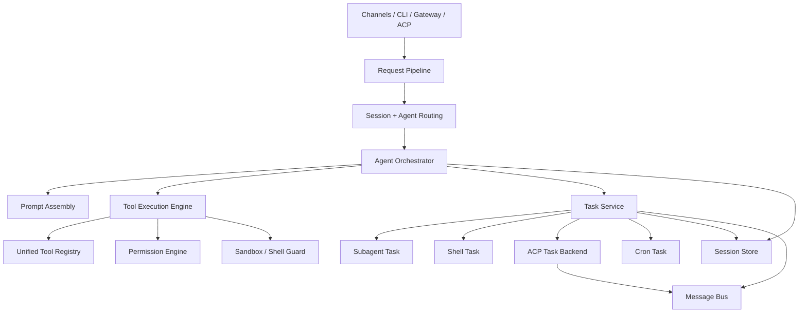

# ClaudeCode 到 SunClaw 的落地改造方案

## 文档目标

这份文档不是要把 SunClaw 改造成另一个 ClaudeCode，而是回答一个更实际的问题：

**ClaudeCode 里哪些架构思想值得吸收，应该落到 SunClaw 的哪些模块，按什么顺序做，才能最大化收益、最小化重构风险。**

结论先说：

- SunClaw 已经具备 ClaudeCode 80% 需要的基础设施
- 不需要重写 `agent/session/acp/sandbox`
- 需要补的是三个“统一层”
  - 统一工具运行时
  - 统一任务模型
  - 统一权限决策

只要把这三层补齐，SunClaw 就能从“功能很多的 Agent 系统”变成“可持续扩展的 Agent Runtime 平台”。

---

## 1. 现状判断

结合当前代码，SunClaw 的基础已经相当扎实：

- 入口与装配
  - [cmd/main.go](/Users/xuechenxi/Documents/company/code/SunClaw/cmd/main.go)
  - [internal/app/cli/root.go](/Users/xuechenxi/Documents/company/code/SunClaw/internal/app/cli/root.go)
- Agent 主循环
  - [internal/core/agent/agent.go](/Users/xuechenxi/Documents/company/code/SunClaw/internal/core/agent/agent.go)
  - [internal/core/agent/orchestrator.go](/Users/xuechenxi/Documents/company/code/SunClaw/internal/core/agent/orchestrator.go)
- Prompt 装配
  - [internal/core/agent/prompt_assembly.go](/Users/xuechenxi/Documents/company/code/SunClaw/internal/core/agent/prompt_assembly.go)
- 会话与历史
  - [internal/core/session/manager.go](/Users/xuechenxi/Documents/company/code/SunClaw/internal/core/session/manager.go)
- Skills
  - `internal/core/agent/skills.go`
- 多 Agent / Subagent
  - [internal/core/agent/tools/subagent_spawn_tool.go](/Users/xuechenxi/Documents/company/code/SunClaw/internal/core/agent/tools/subagent_spawn_tool.go)
  - [internal/core/agent/subagent_announce.go](/Users/xuechenxi/Documents/company/code/SunClaw/internal/core/agent/subagent_announce.go)
- ACP
  - [internal/core/acp/manager.go](/Users/xuechenxi/Documents/company/code/SunClaw/internal/core/acp/manager.go)
- Sandbox
  - `internal/core/sandbox/*`
- 消息总线
  - [internal/core/bus/queue.go](/Users/xuechenxi/Documents/company/code/SunClaw/internal/core/bus/queue.go)
  - [internal/core/bus/events.go](/Users/xuechenxi/Documents/company/code/SunClaw/internal/core/bus/events.go)

SunClaw 当前不是“架构不行”，而是“能力已多，但边界还不够收敛”。

最明显的问题有四个：

1. 工具运行时有重复定义
   - [internal/core/agent/types.go](/Users/xuechenxi/Documents/company/code/SunClaw/internal/core/agent/types.go)
   - [internal/core/agent/agent_tools.go](/Users/xuechenxi/Documents/company/code/SunClaw/internal/core/agent/agent_tools.go)
   - [internal/core/agent/tools/base.go](/Users/xuechenxi/Documents/company/code/SunClaw/internal/core/agent/tools/base.go)
   - [internal/core/agent/tooltypes/tooltypes.go](/Users/xuechenxi/Documents/company/code/SunClaw/internal/core/agent/tooltypes/tooltypes.go)

2. 工具执行逻辑过度集中在 `orchestrator.go`
   - 工具选择、执行、超时、状态计数、子 agent pending 追踪全部揉在一起

3. 权限/审批没有形成统一决策引擎
   - [internal/app/cli/approvals.go](/Users/xuechenxi/Documents/company/code/SunClaw/internal/app/cli/approvals.go) 和 [internal/core/config/schema.go](/Users/xuechenxi/Documents/company/code/SunClaw/internal/core/config/schema.go) 里的 `ApprovalsConfig` 过于简单
   - 当前真正接到审批逻辑的主要是 `sandbox_execute`

4. 后台执行还没有统一成“任务系统”
   - `sessions_spawn`
   - ACP thread
   - shell
   - cron
   - review 类长任务
   这些能力存在，但没有统一的状态模型、输出模型、可观测模型

---

## 2. ClaudeCode 思路如何映射到 SunClaw

### 2.1 概念映射表

| ClaudeCode 概念 | SunClaw 当前落点 | 结论 |
| --- | --- | --- |
| `QueryEngine` | `Agent + Orchestrator` | 保留 SunClaw 现有设计，不新造一套 |
| `processUserInput` | `AgentManager.handleInboundMessage` + 会话命令解析 | 需要抽出请求管线 |
| `Tool.ts + tools.ts` | `ToolRegistry + tools/*` | 需要统一接口与元数据 |
| `ToolUseContext` | 零散 `context.WithValue(...)` | 需要强类型上下文 |
| `Task` 框架 | `sessions_spawn + ACP + bus + session` | 需要补统一任务层 |
| `permissions + sandbox + shell policy` | `ApprovalsConfig + allow_tools/deny_tools + sandbox` | 需要补统一权限引擎 |
| `MCP client/server` | ACP + tool/chat channel 体系 | 不必照搬，ACP 继续做主线 |
| `AppState` | `bus + session + ACP actor queue` | 不要照搬前端状态树 |
| `bridge/remote` | ACP thread-bound runtime | 短期不做 bridge，优先把 ACP 做成任务后端 |

### 2.2 核心判断

SunClaw 最适合吸收的不是 ClaudeCode 的 UI 组织方式，而是这三点：

1. `Tool` 要成为一等运行时对象
2. 所有后台工作都要统一成 `Task`
3. 权限必须在工具执行前统一决策，而不是散落在单个工具内部

---

## 3. 目标架构

建议把 SunClaw 目标形态收敛为下面这个结构：



重点不是新增很多层，而是把现有逻辑重新归位：

- `Orchestrator` 继续做 Query Loop
- `Request Pipeline` 负责输入归一化
- `Tool Execution Engine` 负责工具编排
- `Task Service` 负责后台工作与状态
- `Permission Engine` 负责前置安全决策

---

## 4. 建议新增的三个核心包

### 4.1 `internal/core/permissions`

#### 为什么要新增

现在的审批和限制分散在多个地方：

- `approvals.yaml`
- `allow_tools / deny_tools`
- shell denylist
- sandbox_execute 的本地授权判断

这些规则没有一个统一的判定入口。

#### 建议职责

- 把配置规则编译成运行时 `Policy`
- 对任意工具调用给出统一决策
  - `allow`
  - `deny`
  - `ask`
  - `sandbox_required`
- 对 shell 命令做规则匹配
  - 工具级
  - 前缀级
  - 危险命令级

#### 建议文件

- `internal/core/permissions/types.go`
- `internal/core/permissions/policy.go`
- `internal/core/permissions/engine.go`
- `internal/core/permissions/shell_rules.go`
- `internal/core/permissions/decision.go`

#### 第一版不要做过头

第一版只做：

- 工具级 allow/deny/ask
- shell 前缀规则
- `dangerous` 标记
- sandbox required 决策

不要一上来做复杂 AST classifier。

---

### 4.2 `internal/core/task`

#### 为什么要新增

ClaudeCode 最值得学的地方，是把后台工作统一成 `Task`。

SunClaw 当前其实已经有很多 task 的雏形：

- `sessions_spawn`
- ACP session/thread
- shell 命令
- cron
- 以后可能还有 review / workflow

但现在这些能力没有统一的：

- ID
- 状态
- 输出文件
- 生命周期
- 停止/取消接口
- 事件模型

#### 建议职责

- 统一定义 task 类型和状态
- 持久化 task 元信息
- 追踪输出
- 提供查询、取消、回收能力
- 往 `bus` 发布任务事件

#### 建议文件

- `internal/core/task/types.go`
- `internal/core/task/store.go`
- `internal/core/task/manager.go`
- `internal/core/task/events.go`
- `internal/core/task/output.go`
- `internal/core/task/adapters/subagent.go`
- `internal/core/task/adapters/shell.go`
- `internal/core/task/adapters/acp.go`
- `internal/core/task/adapters/cron.go`

#### 建议的最小数据模型

```go
type TaskType string

const (
    TaskSubagent TaskType = "subagent"
    TaskShell    TaskType = "shell"
    TaskACP      TaskType = "acp"
    TaskCron     TaskType = "cron"
)

type TaskStatus string

const (
    TaskPending   TaskStatus = "pending"
    TaskRunning   TaskStatus = "running"
    TaskCompleted TaskStatus = "completed"
    TaskFailed    TaskStatus = "failed"
    TaskCanceled  TaskStatus = "canceled"
)

type TaskRecord struct {
    ID          string
    Type        TaskType
    SessionKey  string
    AgentID     string
    ParentTaskID string
    Title       string
    Status      TaskStatus
    OutputPath  string
    StartedAt   time.Time
    EndedAt     *time.Time
    Metadata    map[string]any
}
```

#### 任务输出建议

不要先上数据库，直接复用 SunClaw 现有文件式思路：

- `workspace/tasks/<task-id>.json`
- `workspace/tasks/<task-id>.log`

这和当前 `session` 的文件持久化风格一致，工程风险最低。

---

### 4.3 `internal/core/execution`

#### 为什么要新增

SunClaw 当前大量依赖字符串 key 的 `context.WithValue(...)`：

- `session_key`
- `agent_id`
- `workspace_root`
- `bootstrap_owner_id`
- `loop_iteration`
- 以及 channel/account/chat/thread/tenant 等

这会导致：

- 依赖关系隐式
- 工具越来越多后难维护
- 很难知道某个工具真正需要什么运行时能力

#### 建议职责

定义强类型运行时上下文，替代零散 `context.Value`。

#### 建议文件

- `internal/core/execution/context.go`
- `internal/core/execution/request.go`
- `internal/core/execution/tool_context.go`
- `internal/core/execution/options.go`

#### 建议的数据结构

```go
type ToolUseContext struct {
    SessionKey        string
    AgentID           string
    BootstrapOwnerID  string
    WorkspaceRoot     string
    LoopIteration     int

    Channel           string
    AccountID         string
    ChatID            string
    SenderID          string
    TenantID          string
    ThreadID          string

    Policy            *permissions.Policy
    TaskManager       task.Manager
    SessionManager    *session.Manager
    Bus               *bus.MessageBus
}
```

这层不是为了炫技，而是为了让工具、任务、审批共享同一份运行时事实。

---

## 5. 对现有代码的具体映射

### 5.1 `Orchestrator` 保留，但瘦身

当前核心文件：

- [internal/core/agent/orchestrator.go](/Users/xuechenxi/Documents/company/code/SunClaw/internal/core/agent/orchestrator.go)

建议保留它作为主 Query Loop，但抽走三块：

1. 工具执行
   - 新建 `internal/core/agent/tool_executor.go`
   - `executeToolCalls` 移过去

2. 请求预处理
   - 新建 `internal/core/agent/request_pipeline.go`
   - 当前 `AgentManager.handleInboundMessage` 里和输入归一化有关的逻辑移过去

3. 系统通知与恢复策略
   - 新建 `internal/core/agent/recovery.go`
   - `context overflow`、`reflection`、`continuation`、`tool failure` 相关逻辑整理过去

这样 `orchestrator.go` 保持“循环状态机”职责，不继续膨胀。

### 5.2 `ToolRegistry` 继续用，但升级为 `ToolSpec`

当前相关文件：

- [internal/core/agent/tool_registry.go](/Users/xuechenxi/Documents/company/code/SunClaw/internal/core/agent/tool_registry.go)
- [internal/core/agent/tools/registry.go](/Users/xuechenxi/Documents/company/code/SunClaw/internal/core/agent/tools/registry.go)
- [internal/core/agent/tools/base.go](/Users/xuechenxi/Documents/company/code/SunClaw/internal/core/agent/tools/base.go)
- [internal/core/agent/agent_tools.go](/Users/xuechenxi/Documents/company/code/SunClaw/internal/core/agent/agent_tools.go)
- [internal/core/agent/tooltypes/tooltypes.go](/Users/xuechenxi/Documents/company/code/SunClaw/internal/core/agent/tooltypes/tooltypes.go)

建议不要再继续维护四套工具接口，直接收敛成一套。

最稳妥的方式是：

- 以 `internal/core/agent/tooltypes/tooltypes.go` 为基础，扩展统一接口
- 其他几套接口逐步变成兼容 adapter

建议扩展出的元数据：

```go
type ConcurrencyMode string
type InterruptBehavior string
type MutationKind string
type RiskLevel string

type ToolSpec struct {
    Name              string
    Label             string
    Description       string
    Parameters        map[string]any
    Concurrency       ConcurrencyMode
    InterruptBehavior InterruptBehavior
    Mutation          MutationKind
    Risk              RiskLevel
    RequiresSandbox   bool
    RequiresApproval  bool
    DefaultTimeout    time.Duration
}
```

这样改完以后：

- `run_shell` 可以声明自己是 `write + dangerous + serial`
- `read_file` 可以声明自己是 `read + safe + concurrent`
- `sessions_spawn` 可以声明自己是 `side_effect + ask`

这一步是整个改造方案的基础。

### 5.3 `ApprovalsConfig` 从“CLI 配置”升级成“运行时策略”

当前相关文件：

- [internal/app/cli/approvals.go](/Users/xuechenxi/Documents/company/code/SunClaw/internal/app/cli/approvals.go)
- [internal/core/config/schema.go](/Users/xuechenxi/Documents/company/code/SunClaw/internal/core/config/schema.go)

当前问题：

- CLI 有一套 `ApprovalsConfig`
- Core config 也有一套 `ApprovalsConfig`
- 字段还不完全一致

建议：

- 删除 CLI 自己维护的 approvals schema
- 全部以 `internal/core/config/schema.go` 中的 `ApprovalsConfig` 为准
- CLI 只是配置编辑器，不再定义业务模型

建议把配置升级为：

```go
type ApprovalsConfig struct {
    Mode              string   `mapstructure:"mode" json:"mode"`
    AllowTools        []string `mapstructure:"allow_tools" json:"allow_tools"`
    DenyTools         []string `mapstructure:"deny_tools" json:"deny_tools"`
    AskTools          []string `mapstructure:"ask_tools" json:"ask_tools"`
    ShellAllowPrefixes []string `mapstructure:"shell_allow_prefixes" json:"shell_allow_prefixes"`
    ShellDenyPrefixes  []string `mapstructure:"shell_deny_prefixes" json:"shell_deny_prefixes"`
    DangerousToolsAsk bool     `mapstructure:"dangerous_tools_ask" json:"dangerous_tools_ask"`
}
```

第一阶段不要做太细，先把工具级规则跑通。

### 5.4 `sessions_spawn` 升级为 `TaskAdapter`

当前相关文件：

- [internal/core/agent/tools/subagent_spawn_tool.go](/Users/xuechenxi/Documents/company/code/SunClaw/internal/core/agent/tools/subagent_spawn_tool.go)
- [internal/core/agent/subagent_announce.go](/Users/xuechenxi/Documents/company/code/SunClaw/internal/core/agent/subagent_announce.go)

这块现状其实不错，不要推倒重来。

改法应该是：

- 继续保留 `sessions_spawn` 这个工具名
- 但它内部不再只写注册表和 follow-up queue
- 而是改成
  1. 创建 `task.TaskRecord`
  2. 交给 `task/adapters/subagent.go`
  3. 由 adapter 驱动现有 subagent registry / announcer

这样你现有的子 agent 逻辑完全可以继续跑，但会立刻获得：

- 统一 task id
- 统一状态
- 统一输出路径
- 可查询/可取消

### 5.5 Shell 工具从“同步工具”升级为“可后台任务化工具”

当前文件：

- [internal/core/agent/tools/shell.go](/Users/xuechenxi/Documents/company/code/SunClaw/internal/core/agent/tools/shell.go)

当前问题：

- shell 只能作为当前轮次里的同步工具执行
- 没有统一任务状态
- 审批逻辑主要靠 denylist 和 sandbox 开关

建议两步走：

第一步：

- 先给 `run_shell` 增加统一的 preflight
  - permission engine
  - sandbox decision
  - timeout policy

第二步：

- 新增 `run_shell_background`
- 实际底层复用 task adapter
- 输出写入 `workspace/tasks/<task-id>.log`
- 通过 `bus` 发进度事件

这比直接把所有 shell 都做成后台任务更稳。

### 5.6 ACP 不要重写，直接当 Task Backend

当前文件：

- [internal/core/acp/manager.go](/Users/xuechenxi/Documents/company/code/SunClaw/internal/core/acp/manager.go)

ACP 这套设计已经很成熟，特别是：

- actor queue
- active turn state
- runtime cache
- thread-bound session

建议不要把 ACP 当成“独立系统”，而是把它接进统一任务层：

- 长生命周期 ACP thread -> `TaskType=acp`
- ACP turn execution -> `TaskEvent`
- ACP 中断/继续 -> task control API

这样你的聊天渠道、CLI、未来 TUI 都能用同一套 task 查询接口看 ACP 状态。

---

## 6. 分阶段实施计划

## Phase 1: 收敛运行时契约

### 目标

不改行为，只统一接口和上下文。

### 任务

1. 在 `tooltypes` 或新 `execution` 包中定义统一 `ToolSpec` 和 `ToolUseContext`
2. 让 `ToolRegistry` 只认一种内部工具接口
3. 让现有工具通过 adapter 接入
4. 把 `orchestrator.go` 中的 `context.WithValue` 收敛到一个构造函数

### 改动文件

- 修改 [internal/core/agent/tooltypes/tooltypes.go](/Users/xuechenxi/Documents/company/code/SunClaw/internal/core/agent/tooltypes/tooltypes.go)
- 修改 [internal/core/agent/tool_registry.go](/Users/xuechenxi/Documents/company/code/SunClaw/internal/core/agent/tool_registry.go)
- 修改 [internal/core/agent/agent_tools.go](/Users/xuechenxi/Documents/company/code/SunClaw/internal/core/agent/agent_tools.go)
- 修改 [internal/core/agent/tools/base.go](/Users/xuechenxi/Documents/company/code/SunClaw/internal/core/agent/tools/base.go)
- 新增 `internal/core/execution/context.go`

### 交付标准

- 现有工具全部还能跑
- 不再新增第五套工具接口
- `orchestrator.go` 不再到处拼字符串 key

---

## Phase 2: 抽出 Tool Execution Engine

### 目标

把工具编排从 `Orchestrator` 中拆出去，并为后续权限与并发打基础。

### 任务

1. 新增 `tool_executor.go`
2. 把 `executeToolCalls` 整体迁移过去
3. 加入 `ToolSpec` 驱动的执行策略
   - 串行
   - 可并发
   - interrupt behavior
4. 保留现有 streaming update 事件

### 建议新增文件

- `internal/core/agent/tool_executor.go`
- `internal/core/agent/tool_executor_test.go`

### 这一步完成后能得到什么

- `Orchestrator` 变小
- 工具并发模型可控
- 后续权限引擎接入点清晰

---

## Phase 3: 落地 Permission Engine

### 目标

把审批、allow/deny、dangerous、sandbox 决策统一起来。

### 任务

1. 新增 `internal/core/permissions`
2. 合并 CLI approvals 与 core approvals schema
3. `ToolExecutor` 在调用工具前先拿 `PermissionDecision`
4. Shell 工具接入 shell prefix rule
5. `sessions_spawn`, `run_shell`, `sandbox_execute`, `browser` 先接入

### 优先接入的工具

- `run_shell`
- `sandbox_execute`
- `sessions_spawn`
- `browser`
- `edit_file`

### 不要做的事

- 不要先上 LLM classifier
- 不要先做超复杂企业策略系统
- 不要在每个工具内部各写一份授权判断

---

## Phase 4: 统一 Task Framework

### 目标

把后台执行、远程执行、长生命周期执行统一管理。

### 任务

1. 新增 `internal/core/task`
2. 让 `sessions_spawn` 走 `SubagentTaskAdapter`
3. 增加 `ShellTaskAdapter`
4. ACP 接入 `AcpTaskAdapter`
5. bus 发布 task start/update/end 事件
6. 增加基础 CLI
   - `sunclaw tasks list`
   - `sunclaw tasks get <id>`
   - `sunclaw tasks stop <id>`

### 建议先不做 UI

对 SunClaw 来说，`bus + session + task json` 已经足够。
不要先复制 ClaudeCode 的 UI 状态树。

---

## Phase 5: 请求管线化

### 目标

让 `AgentManager` 只做路由和装配，不再处理过多输入细节。

### 任务

1. 新增 `request_pipeline.go`
2. 归一化以下逻辑：
   - `/agent`
   - `/new`
   - session route
   - thread route
   - inbound media
   - interrupt / resume
   - ACP thread 控制消息
3. 输出统一的 `PreparedTurn`

### 建议的数据结构

```go
type PreparedTurn struct {
    SessionKey   string
    AgentID      string
    UserMessages []agent.AgentMessage
    ToolPolicy   *permissions.Policy
    WorkspaceRoot string
    Metadata     map[string]any
}
```

### 目标结果

- `handleInboundMessage` 只做“调 pipeline -> 调 orchestrator -> 发 reply”
- 复杂输入规则不再散落在 manager 和 agent 里

---

## 7. 最推荐的实施顺序

如果只能做一轮中等规模改造，我建议顺序固定为：

1. 统一工具接口
2. 抽 ToolExecutor
3. 上 Permission Engine
4. 上 Task Framework
5. 最后再做 Request Pipeline

理由很简单：

- 没有统一工具接口，权限和任务都挂不上去
- 没有 ToolExecutor，权限接入点会很散
- 没有 Permission Engine，后台任务会很危险
- 没有 Task Framework，Subagent/ACP/Shell 还是各管各的
- Request Pipeline 最后做，风险最低

---

## 8. 建议你这周就落地的第一批改动

如果要开始干，我建议先做一版最小实现：

### Sprint 1

1. 统一 `ToolSpec`
   - 收敛 [internal/core/agent/types.go](/Users/xuechenxi/Documents/company/code/SunClaw/internal/core/agent/types.go)
   - 收敛 [internal/core/agent/agent_tools.go](/Users/xuechenxi/Documents/company/code/SunClaw/internal/core/agent/agent_tools.go)
   - 收敛 [internal/core/agent/tools/base.go](/Users/xuechenxi/Documents/company/code/SunClaw/internal/core/agent/tools/base.go)

2. 新增 `ToolUseContext`
   - 替换 `orchestrator.go` 中字符串 key 的 `context.WithValue`

3. 抽 `tool_executor.go`
   - 先做到“结构分离，不改行为”

4. 新增 `permissions` 包
   - 先支持工具级 `allow/deny/ask`

5. 让 `run_shell` 接权限判断

### Sprint 2

1. 新增 `task` 包
2. 把 `sessions_spawn` 接到 task
3. 增加 `tasks list/get/stop`
4. bus 发布 task 事件

### Sprint 3

1. ACP 接 task
2. shell background task 化
3. request pipeline 化

---

## 9. 明确不建议照搬的部分

### 9.1 不要照搬 ClaudeCode 的前端状态树

SunClaw 是多渠道、服务型、聊天驱动系统，不是本地单用户 REPL 产品。

ClaudeCode 的 `AppState` 对它有意义，但对 SunClaw 最优解不是同一路。

SunClaw 应该优先复用：

- `bus`
- `session`
- `task store`
- `ACP actor queue`

### 9.2 不要先做 Bridge

ClaudeCode 的 bridge/remote-control 很强，但 SunClaw 当前更实际的路线是：

- 先把 ACP 做成 thread-bound task backend
- 再考虑跨端/远端运行

否则复杂度会上升太快。

### 9.3 不要继续容忍多套 Tool 接口

这是当前最容易让代码继续发散的点。

如果这次只做一件事，那就先把 Tool 契约统一掉。

---

## 10. 最终落地效果

做完这轮后，SunClaw 会得到几个非常明显的收益：

1. Agent 主循环更稳定
   - `Orchestrator` 只关心“何时问模型、何时跑工具、何时收束”

2. 工具扩展成本下降
   - 新工具接入不再需要猜上下文和审批逻辑

3. 后台任务真正成为平台能力
   - 子 agent、ACP、shell、cron 有统一状态和控制面

4. 安全边界更清楚
   - 审批和沙箱不再只是单工具内逻辑

5. 更适合后续做 TUI / Dashboard / 任务面板
   - 因为 task/bus/session 已经形成统一事件源

---

## 11. 一句话版本

对 SunClaw 来说，最正确的映射方式不是“照抄 ClaudeCode 的模块”，而是：

**保留现有 `Orchestrator + Session + ACP + Bus + Sandbox`，新增 `Permission Engine + Task Framework + Typed Tool Runtime` 三个统一层。**

这样改造成本可控，但收益最大。

