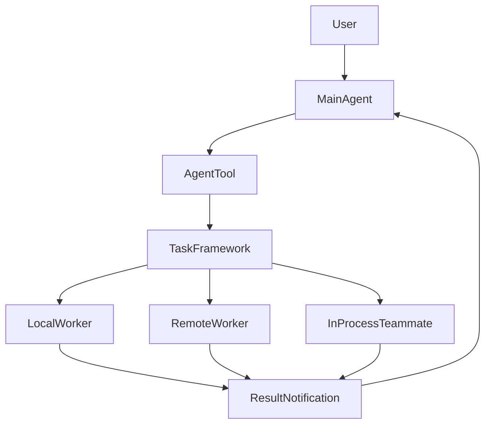
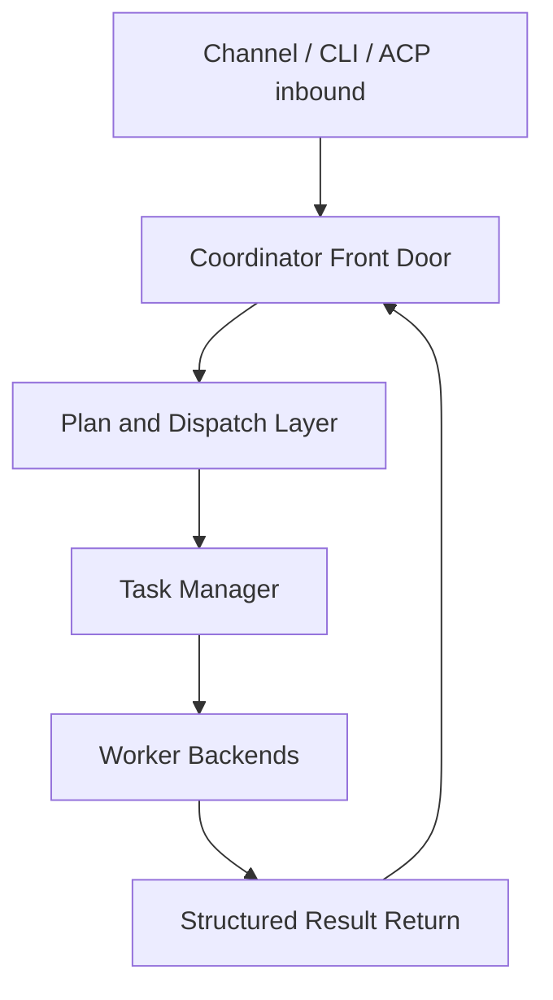
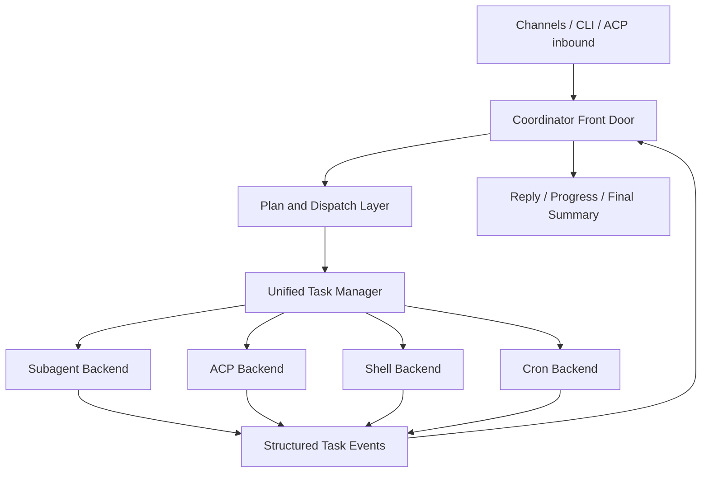

# SunClaw 协调器目标架构设计

## 文档目标

这份文档回答的是一个具体问题：

**如果参考 Claude Code 的协调器思路，SunClaw 的主编排器、子 Agent 派发、ACP、任务系统和结果回流应该怎么设计，哪些值得借，哪些不该照搬。**

这里的“协调器”不是某个单独类名，而是下面这套组合能力：

- 主编排 Agent 的身份与行为约束
- 子 Agent 派发入口
- 任务生命周期管理
- 子 Agent 结果回流
- 多后端 worker 执行

---

## 1. 先说结论

Claude Code 值得 SunClaw 借鉴的，不是它的桌面 UI，也不是它的 pane teammate 体系，而是这三个结构原则：

1. **统一派发入口**
   - 所有子 Agent 调用都从一个入口出去，而不是每种 worker 各写一套分支逻辑。

2. **统一任务模型**
   - 派发之后先落到任务层，再决定本地/远程/in-process/backend 怎么跑。

3. **结果通过结构化通知回流**
   - 主编排器不直接共享子 Agent 的原始执行上下文，只消费结构化结果，再决定下一步。

SunClaw 现有代码里，已经具备这些原则的基础设施：

- 主编排循环
  - [orchestrator.go](/Users/xuechenxi/Documents/company/code/SunClaw/internal/core/agent/orchestrator.go)
- Agent 管理与路由
  - [manager.go](/Users/xuechenxi/Documents/company/code/SunClaw/internal/core/agent/manager.go)
- 子 Agent 派发工具
  - [subagent_spawn_tool.go](/Users/xuechenxi/Documents/company/code/SunClaw/internal/core/agent/tools/subagent_spawn_tool.go)
- 子 Agent 结果回流
  - [subagent_announce.go](/Users/xuechenxi/Documents/company/code/SunClaw/internal/core/agent/subagent_announce.go)
- ACP runtime
  - [manager.go](/Users/xuechenxi/Documents/company/code/SunClaw/internal/core/acp/manager.go)
- 消息总线
  - [queue.go](/Users/xuechenxi/Documents/company/code/SunClaw/internal/core/bus/queue.go)

所以 SunClaw 不应该推倒重来，而应该做的是：

**把现有 subagent / ACP / shell background / cron 收敛进统一协调框架。**

---

## 2. Claude Code 协调器的本质

Claude Code 的协调器不是一个传统“中央调度服务”，而是：

- `AgentTool` 负责统一派发入口
- `runAgent` 负责执行一个具体 worker
- `Task` 框架负责生命周期
- `coordinatorMode` 负责把主 agent 的 prompt 变成真正的协调者

它的结构可以概括成：



SunClaw 已经有类似雏形，只是还没有统一起来。

---

## 3. SunClaw 当前协调器现状

### 3.1 已有能力

SunClaw 当前的主编排/协作能力已经不少：

- `orchestrator.go`
  - 主循环
  - LLM 调用
  - 工具执行
  - 子 Agent pending 计数
  - follow-up 注入

- `manager.go`
  - Agent 创建
  - session 路由
  - channel / binding / agent routing
  - subagent goroutine 启动
  - ACP thread 控制

- `subagent_spawn_tool.go`
  - 子 Agent 派发工具
  - 结构化参数
  - target agent 选择
  - 子 session key / run id 生成
  - 子 Agent system prompt 构造

- `subagent_announce.go`
  - 子 Agent 执行结果结构化回流

- `acp/manager.go`
  - ACP session lifecycle
  - per-session actor queue
  - active turn state

### 3.2 当前缺口

虽然功能已经有了，但协调器层还缺 4 个关键结构：

1. **统一的任务层**
   - 现在 `sessions_spawn`、ACP、后台 shell、cron 不是同一模型

2. **统一的派发后端接口**
   - 现在 subagent 是一套，ACP 是一套，shell background 未来又会是一套

3. **统一的结果通知协议**
   - subagent 回流已经有了，但 ACP / shell / cron 还没完全统一

4. **主编排器与 worker 的职责边界**
   - 现在逻辑上已经有边界，但还没被架构化固定住

---

## 4. SunClaw 协调器目标分层

我建议把 SunClaw 的协调器拆成下面 5 层：



对应到代码，建议是：

### Layer 1: Coordinator Front Door

职责：

- 接收用户消息
- 恢复 session / current plan / pending step
- 识别“这是普通回复、要出计划、还是要推进步骤”

当前对应：

- [manager.go](/Users/xuechenxi/Documents/company/code/SunClaw/internal/core/agent/manager.go)
- [session_agent_router.go](/Users/xuechenxi/Documents/company/code/SunClaw/internal/core/agent/session_agent_router.go)
- [session_context_router.go](/Users/xuechenxi/Documents/company/code/SunClaw/internal/core/agent/session_context_router.go)

建议未来位置：

- `internal/core/coordinator/frontdoor.go`

### Layer 2: Plan and Dispatch Layer

职责：

- 生成最小计划
- 决定当前推进哪一步
- 为这一步选择最合适的子 Agent
- 生成结构化派发载荷

当前对应：

- prompt 约束 + `sessions_spawn`

建议未来位置：

- `internal/core/coordinator/planner.go`
- `internal/core/coordinator/dispatch.go`

### Layer 3: Task Manager

职责：

- 创建 task id
- 记录 task metadata
- 跟踪状态
- 保存输出
- 提供 stop / list / get

当前对应：

- 还没有统一层

建议未来位置：

- `internal/core/task/*`

### Layer 4: Worker Backends

职责：

- 真正执行被派发出去的步骤

建议分成：

- `SubagentBackend`
- `ACPBackend`
- `ShellBackend`
- `CronBackend`

### Layer 5: Structured Result Return

职责：

- worker 完成后，把结果回流成统一格式
- 主编排器消费后决定下一步

当前部分已有：

- [subagent_announce.go](/Users/xuechenxi/Documents/company/code/SunClaw/internal/core/agent/subagent_announce.go)

建议未来扩展成统一协议。

---

## 5. SunClaw 主编排器应该如何工作

主编排器不是实现者，而是流程控制者。

### 5.1 主编排器职责

主编排器只做：

1. 识别用户目标
2. 判断是否需要计划
3. 选择当前一步
4. 选择最合适的 worker
5. 派发当前一步
6. 消费结果
7. 判断是否继续下一步
8. 汇总给用户

### 5.2 主编排器不该做什么

主编排器不应该：

- 亲自实现代码
- 亲自修 bug
- 亲自跑验证步骤
- 亲自做长时间检索
- 同时规划和执行所有细节

这就是为什么你前面那套 prompt 里“主编排 Agent 不亲自执行研发任务”是对的。

---

## 6. 子 Agent 的调用方式应该怎么统一

### 6.1 当前 `sessions_spawn` 的位置

现在子 Agent 调用主要通过：

- [subagent_spawn_tool.go](/Users/xuechenxi/Documents/company/code/SunClaw/internal/core/agent/tools/subagent_spawn_tool.go)

这个工具已经做了很多正确的事：

- 接收结构化派发参数
- 生成 `child_session_key`
- 生成 `run_id`
- 选择 target agent
- 构造 subagent system prompt
- 调用 `onSpawn` 回调

### 6.2 应该如何升级

现在它更像“直接派发器”，未来它应该升级成：

**统一任务创建入口**

即：

1. 解析派发参数
2. 生成 `TaskRecord`
3. 选择 backend
4. backend 启动 worker
5. 返回 task handle

所以 `sessions_spawn` 最终应该只是：

```text
Coordinator tool call
    -> create task
    -> choose backend
    -> launch worker
    -> return task handle
```

而不是把全部逻辑都堆在工具本身里。

---

## 7. 统一任务框架应该长什么样

这是 SunClaw 接下来最该落的结构。

### 7.1 核心类型

```go
type TaskType string

const (
    TaskSubagent TaskType = "subagent"
    TaskACP      TaskType = "acp"
    TaskShell    TaskType = "shell"
    TaskCron     TaskType = "cron"
)

type TaskStatus string

const (
    TaskPending   TaskStatus = "pending"
    TaskRunning   TaskStatus = "running"
    TaskCompleted TaskStatus = "completed"
    TaskFailed    TaskStatus = "failed"
    TaskCanceled  TaskStatus = "canceled"
)

type TaskRecord struct {
    ID           string
    Type         TaskType
    SessionKey   string
    ParentTaskID string
    AgentID      string
    StepLabel    string
    Description  string
    Status       TaskStatus
    OutputPath   string
    StartedAt    time.Time
    EndedAt      *time.Time
    Metadata     map[string]any
}
```

### 7.2 管理器职责

`TaskManager` 应该负责：

- `CreateTask`
- `StartTask`
- `CompleteTask`
- `FailTask`
- `CancelTask`
- `GetTask`
- `ListTasks`
- `AppendOutput`
- `EmitTaskEvent`

### 7.3 结果文件

建议简单一点，先走文件：

- `workspace/tasks/<task-id>.json`
- `workspace/tasks/<task-id>.log`

不要一开始就引入额外数据库。

---

## 8. Worker Backend 如何划分

### 8.1 Subagent Backend

对应当前的动态分身：

- session 隔离
- 独立 goroutine
- 独立 prompt
- 执行完成后回流

当前代码主要在：

- [manager.go](/Users/xuechenxi/Documents/company/code/SunClaw/internal/core/agent/manager.go)
- [subagent_spawn_tool.go](/Users/xuechenxi/Documents/company/code/SunClaw/internal/core/agent/tools/subagent_spawn_tool.go)
- [subagent_announce.go](/Users/xuechenxi/Documents/company/code/SunClaw/internal/core/agent/subagent_announce.go)

未来应该包装成：

- `internal/core/task/backends/subagent_backend.go`

### 8.2 ACP Backend

对应：

- [manager.go](/Users/xuechenxi/Documents/company/code/SunClaw/internal/core/acp/manager.go)
- [spawn.go](/Users/xuechenxi/Documents/company/code/SunClaw/internal/core/acp/spawn.go)

ACP backend 的优势是：

- 已经有 session lifecycle
- 已经有 actor queue
- 已经有 active turn state

所以不应该和主协作体系平行存在，而应该成为 task backend 的一种实现。

### 8.3 Shell Backend

未来如果你做 `run_shell_background`，它不应该直接挂在 shell 工具内部，而应该：

- 创建 task
- 启动后台 shell process
- 写 output log
- 发 task event

### 8.4 Cron Backend

cron 本质上也是“延迟启动一个 worker”，所以天然适合挂到 task backend。

---

## 9. 结果回流协议应该怎么设计

Claude Code 的关键优点之一，是 worker 结果不会直接污染主线程上下文，而是通过结构化通知回流。

SunClaw 当前已经有类似形态：

- [subagent_announce.go](/Users/xuechenxi/Documents/company/code/SunClaw/internal/core/agent/subagent_announce.go)

建议统一成下面这种协议：

```json
{
  "task_id": "task-123",
  "type": "subagent",
  "status": "completed",
  "step_label": "implement-api",
  "agent_id": "BackendCoder",
  "summary": "后端接口实现完成",
  "result": "...",
  "artifacts": ["internal/api/user.go", "internal/service/profile.go"],
  "verification": ["go test ./internal/service/..."],
  "error": "",
  "next_hint": "可进入 reviewer 步骤"
}
```

然后主编排器只消费这类通知，不直接读 worker 的整段内部历史。

---

## 10. 主编排器状态机建议

如果你要把主编排器做稳定，建议显式分 5 个状态：

```text
Idle
  -> Planning
  -> Dispatching
  -> WaitingResults
  -> Synthesizing
  -> Replying
```

### 状态含义

- `Idle`
  - 等待用户消息

- `Planning`
  - 生成或重算当前最小计划

- `Dispatching`
  - 只派发当前一步

- `WaitingResults`
  - 等待当前一步结果回流

- `Synthesizing`
  - 读取结果、判断是否继续下一步

- `Replying`
  - 向用户输出当前结论或最终结论

这个状态机可以挂在：

- `CoordinatorState`
- 或存在 session metadata 里

---

## 11. 借 Claude Code 的优势在哪里

### 11.1 好处

#### 1. 统一入口，能力可扩展

今天你有 `sessions_spawn`，明天你再加 ACP、后台 shell、workflow，不会每次都重新设计一套派发语义。

#### 2. 主上下文更干净

主编排器不需要直接吞 worker 所有执行日志，只需要结构化结果。

#### 3. 更适合并发

调度器只负责 fan-out / fan-in，不被具体执行细节拖住。

#### 4. 生命周期可控

能取消、能查询、能归档、能恢复。

#### 5. Prompt 更清晰

主 agent 和子 agent 的角色边界更稳。

### 11.2 坏处

#### 1. 复杂度上升

你从“一个 agent 系统”升级成“agent runtime 平台”。

#### 2. 调试更难

要同时看：

- prompt
- dispatch
- task state
- worker backend
- result return

#### 3. 可能过度派发

如果主编排 prompt 不够克制，会把简单问题都外包出去。

#### 4. 一致性要求更高

主编排器、任务框架、worker backend、结果协议之间必须严密一致，否则状态很容易乱。

---

## 12. 哪些不要照搬 Claude Code

### 不要照搬 1: pane / teammate 可视化后端

SunClaw 当前不是桌面终端 UI 产品，不需要先上 tmux / iTerm / pane teammate 体系。

### 不要照搬 2: 过重的 AppState

SunClaw 有：

- `bus`
- `session`
- `acp actor queue`

已经够做协调器状态传播，不需要复制一个前端状态树。

### 不要照搬 3: 过多 feature gate

Claude Code 的 build 裁剪很多，但 SunClaw 当前更需要的是稳定清晰，而不是复杂 build matrix。

---

## 13. 建议的 SunClaw 目标架构



---

## 14. 建议实施顺序

### Phase 1

- 保持 `sessions_spawn`
- 新增 `internal/core/task`
- 把 subagent 派发先接入 task framework

### Phase 2

- 把 ACP 接成 task backend
- 统一 stop/list/get

### Phase 3

- shell background task 化
- cron task 化

### Phase 4

- 显式 coordinator state machine
- 结构化 step plan persistence

---

## 15. 一句话结论

SunClaw 最合适的协调器路线，不是照搬 Claude Code 的 UI/teammate 形态，而是借它的核心结构：

**主编排器负责计划与派发，统一入口把工作送进任务框架，不同执行模式都变成 worker backend，结果用结构化通知回流。**

如果你愿意，我下一步可以继续做：

1. 直接把这份目标架构文档映射成 `internal/core/task` 的代码骨架
2. 或先给你画 `sessions_spawn -> task backend -> subagent return` 的 SunClaw 实现时序图
