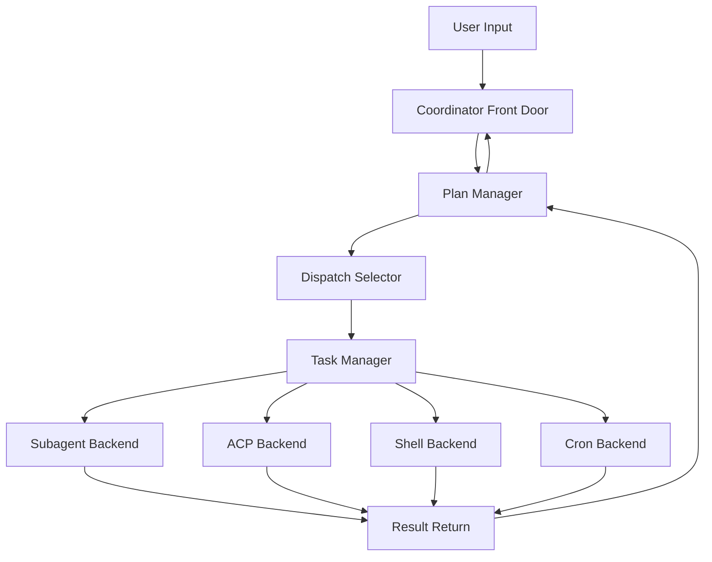

# SunClaw 多 Agent 编排优化方案

## 文档目标

这份文档回答一个非常具体的问题：

**Claude Code 的多 Agent 编排为什么更稳定，SunClaw 要怎么优化，才能稳定做到“先写计划，再按计划派发任务，再基于真实结果推进下一步”。**

这里强调的不是“多开几个子 Agent”，而是下面这条闭环：

1. 能判断当前是不是该先出计划
2. 能把计划写成结构化步骤
3. 能为当前步骤选择合适的子 Agent
4. 能把步骤派发成受控任务
5. 能等待真实结果回流
6. 能基于真实结果推进下一步，而不是脑补完成

---

## 1. 先给结论

Claude Code 的强项不在“可以调用 AgentTool”本身，而在于它把多 Agent 协作做成了一个完整的运行时协议：

1. **主 Agent 是显式 coordinator**
   - 它不是“顺手派发一下”的普通聊天 Agent，而是被专门约束成“负责计划、调度、汇总”的协调器。

2. **派发入口是统一的**
   - 所有 worker 都通过一个统一入口出去，而不是“某种任务一个工具，另一种任务另一套接口”。

3. **任务是第一等对象**
   - 派发出去的不是“一次临时调用”，而是一个有 `task id / status / output / notification` 的后台任务。

4. **结果回流是结构化的**
   - worker 完成后，不是靠 coordinator 猜上下文，而是把结果包装成结构化通知再注回主循环。

5. **最关键的一点：coordinator 被明确训练成“先综合，再派发”**
   - 不是把“理解问题”也外包给子 Agent。
   - 它要先吸收 research 结果，再自己写出高质量的下一步 spec，再决定继续原 worker 还是新开 worker。

SunClaw 现在已经具备：

- 主循环
- 子 Agent 派发
- 子 Agent 结果回流
- 最小任务记录

但是还缺 4 个关键结构：

1. 显式的 **Plan 层**
2. 显式的 **Dispatch 层**
3. 显式的 **Continue / Respawn 决策机制**
4. 显式的 **PlanStep -> Task** 绑定关系

如果这 4 个结构不补，SunClaw 仍然更像“会派子 Agent 的单 Agent”，而不是“真正的 coordinator runtime”。

---

## 2. Claude Code 的多 Agent 编排方法

## 2.1 两层编排

Claude Code 的多 Agent 不是只有一个 `AgentTool`。

它实际上有两层：

### 第一层：Prompt 层 coordinator

`coordinatorMode.ts` 里最重要的不是工具名，而是 coordinator system prompt。

这个 prompt 明确规定：

- 主 Agent 是 coordinator，不是实现者
- 多数任务要拆成 `Research -> Synthesis -> Implementation -> Verification`
- research 结果回来后，主 Agent 必须先自己综合，再写下一步 worker prompt
- 不能写 “based on your findings...” 这种懒惰 prompt
- 要明确判断“继续原 worker”还是“新开 worker”

这一步直接决定了模型行为。

如果没有这层 prompt，即使 runtime 有 `AgentTool`，模型也很容易：

- 乱派
- 一次派太多职责
- 把未完成工作说成已完成
- 让 worker 自己继续理解和拆分，导致上下文污染

### 第二层：Task Runtime 层

`AgentTool.tsx` + `LocalAgentTask.tsx` + `RemoteAgentTask.tsx` 负责把派发变成正式后台任务。

关键特征：

- 有统一 task id
- 有 task state
- 有 foreground/background
- 有 output file
- 有 progress
- 有 completion notification
- 可以 stop
- 可以 continue

这意味着 coordinator 不需要“盯着子 Agent 的原始对话内容”，只需要消费结构化通知。

---

## 2.2 Claude Code 的核心运行原则

### 原则 1：Research 和 Implementation 分离

它不是一上来就把“理解 + 设计 + 改代码 + 验证”打给一个 worker。

典型流程是：

1. 先 research
2. coordinator 消化 research 结果
3. coordinator 写 implementation spec
4. 再派 implementation worker
5. 再派 verification worker

这个结构极大减少了“错误上下文延续”。

### 原则 2：Coordinator 自己负责综合

Claude Code 最强的不是会派发，而是 **它明确禁止 coordinator 把综合工作外包**。

比如它明确反对：

- “based on your findings, fix it”
- “the worker found something in auth, please implement”

它要求 coordinator 自己写出：

- 文件路径
- 关键位置
- 原因
- 要改什么
- 验证目标

这就是它为什么“派发质量”高。

### 原则 3：Continue vs Spawn 是显式决策

Claude Code 不把“继续原 worker”当成默认。

它看的是：

- 当前 worker 的已有上下文和下一步是否高度重合

高重合：

- 继续原 worker

低重合：

- 新开 worker

这点非常关键。

否则 worker 会带着旧探索噪音进入新任务，导致上下文污染和注意力漂移。

### 原则 4：结果通过结构化通知回流

Local/Remote task 完成后，结果不是普通聊天消息，而是包成通知对象回到 coordinator。

本质上是：

```xml
<task-notification>
  <task-id>...</task-id>
  <status>completed|failed|killed</status>
  <summary>...</summary>
  <result>...</result>
  <usage>...</usage>
</task-notification>
```

这个结构的意义是：

- 主 Agent 不用猜
- 主 Agent 不用重新读子 Agent transcript
- 任务状态是机器可消费的

---

## 3. SunClaw 当前多 Agent 编排现状

## 3.1 已有能力

SunClaw 当前已经有：

- 子 Agent 派发入口
  - [subagent_spawn_tool.go](/Users/xuechenxi/Documents/company/code/SunClaw/internal/core/agent/tools/subagent_spawn_tool.go)
- 主 Agent 到子 Agent 的 prompt 隔离
  - [prompt_assembly.go](/Users/xuechenxi/Documents/company/code/SunClaw/internal/core/agent/prompt_assembly.go)
- 子 Agent 结果结构化回流
  - [subagent_announce.go](/Users/xuechenxi/Documents/company/code/SunClaw/internal/core/agent/subagent_announce.go)
- 子 Agent 最小任务记录
  - [manager.go](/Users/xuechenxi/Documents/company/code/SunClaw/internal/core/agent/manager.go)
  - [manager.go](/Users/xuechenxi/Documents/company/code/SunClaw/internal/core/task/manager.go)
- 子 Agent 的结构化派发载荷
  - `label / task / context / relevant_files / constraints / deliverables / done_when`

所以 SunClaw 不是“没有多 Agent 基础”，而是“还没把这些能力升格成 coordinator protocol”。

## 3.2 当前缺口

### 缺口 1：没有显式 Plan 模型

现在 SunClaw 可以派发 task，但还没有一份正式的 `PlanRecord`。

后果是：

- “当前是计划态还是执行态”主要靠 prompt 猜
- 缺少 `CurrentStep`
- 缺少 `StepStatus`
- 缺少 `Step -> Task` 绑定
- 缺少“用户变更目标后如何重算计划”的正式状态

### 缺口 2：没有 Continue 子任务的统一接口

目前 SunClaw 有 `sessions_spawn`，但没有 Claude Code 那种清晰的：

- continue existing worker
- stop worker
- list/get worker

后果是：

- coordinator 只能反复 spawn
- 无法优雅利用“高上下文重合”的 worker
- 修错、补充、追加验证都只能靠新任务

### 缺口 3：主编排 prompt 虽然在改进，但还没形成完整的 phase protocol

当前 prompt 已经强调：

- 主编排不亲自实现
- 默认串行
- 当前一步最小化

但还没像 Claude Code 一样明确把流程写成：

- Research
- Synthesis
- Implementation
- Verification

也没把 `继续原 worker vs 新开 worker` 写成明确决策规则。

### 缺口 4：Task 模型还太薄

当前 `internal/core/task` 只够记录：

- id
- backend
- status
- result
- subagent payload

还不够表达：

- plan_id
- step_id
- parent_task_id
- task_type
- continuation_of
- can_continue
- notification_status
- verification_status
- stop_reason

### 缺口 5：缺少并发治理

Claude Code 明确区分：

- research 可以并发
- write-heavy implementation 要控制写集
- verification 尽量独立

SunClaw 现在还没有正式的：

- file ownership / write scope
- conflicting task detection
- per-step dispatch strategy

---

## 4. SunClaw 目标：必须保证“能写计划，也能按计划派发任务”

这一目标不是一句 prompt 能保证的，必须同时满足 5 个条件：

### 条件 1：计划必须可持久化

计划不能只是模型脑中的临时文本。

必须有：

- plan id
- goal
- steps
- current step
- step status

### 条件 2：每个任务必须隶属于某个步骤

不能出现：

- 派了一个 task
- 但不知道它属于计划里的哪一步

必须做到：

- `PlanStep -> TaskRecord`

### 条件 3：主编排不得越过当前步骤直接推进

必须保证：

- 当前 step 未 terminal，不进入下一 step
- 除非显式标记为可并行

### 条件 4：主编排必须消费真实结果后再推进

不能：

- spawn 完就默认“这一阶段在进行”
- 没结果就假设成功

必须：

- `task.status` terminal
- 有结构化 result / error / timeout
- 才能修改 `step.status`

### 条件 5：派发载荷必须结构化

每次派发必须至少有：

- 当前步骤目标
- 边界
- 交付物
- 完成标准

否则计划就算写出来，也无法稳定落地。

---

## 5. 目标架构



## 5.1 Layer 1: Coordinator Front Door

职责：

- 判断是直接回答、先计划、还是推进计划
- 恢复当前 plan / step / pending task
- 响应用户的目标变更

建议文件：

- `internal/core/coordinator/frontdoor.go`

## 5.2 Layer 2: Plan Manager

职责：

- 创建计划
- 更新计划
- 选择当前步骤
- 基于任务结果推进步骤状态

建议文件：

- `internal/core/plan/types.go`
- `internal/core/plan/manager.go`
- `internal/core/plan/store.go`

## 5.3 Layer 3: Dispatch Selector

职责：

- 给当前 `PlanStep` 选择最合适 agent
- 决定 `spawn` 还是 `continue`
- 决定串行还是并行
- 生成结构化派发载荷

建议文件：

- `internal/core/coordinator/dispatch.go`
- `internal/core/coordinator/selector.go`

## 5.4 Layer 4: Task Manager

职责：

- 统一任务生命周期
- 统一任务状态
- 统一 backend 适配
- 统一 stop / list / get

当前已有雏形：

- [manager.go](/Users/xuechenxi/Documents/company/code/SunClaw/internal/core/task/manager.go)

建议扩展：

- `events.go`
- `control.go`
- `backend.go`

## 5.5 Layer 5: Result Return

职责：

- 把任意 backend 的完成结果转换成统一结构
- 注入主编排 follow-up
- 更新 task / plan / step 状态

---

## 6. 必须新增的两个一等模型

## 6.1 PlanRecord

```go
type PlanStatus string

const (
    PlanDraft     PlanStatus = "draft"
    PlanActive    PlanStatus = "active"
    PlanCompleted PlanStatus = "completed"
    PlanBlocked   PlanStatus = "blocked"
    PlanCanceled  PlanStatus = "canceled"
)

type StepStatus string

const (
    StepPending   StepStatus = "pending"
    StepReady     StepStatus = "ready"
    StepRunning   StepStatus = "running"
    StepDone      StepStatus = "completed"
    StepBlocked   StepStatus = "blocked"
    StepFailed    StepStatus = "failed"
    StepSkipped   StepStatus = "skipped"
)

type PlanStep struct {
    ID            string
    Title         string
    Kind          string
    Goal          string
    AgentHint     string
    Strategy      string // serial / parallel / continue_existing / spawn_fresh
    RelevantFiles []string
    Constraints   []string
    Deliverables  []string
    DoneWhen      []string
    DependsOn     []string
    Status        StepStatus
    TaskID        string
    Notes         string
}

type PlanRecord struct {
    ID                string
    SessionKey        string
    Goal              string
    Status            PlanStatus
    Steps             []PlanStep
    CurrentStepID     string
    LastDecision      string
    CreatedAt         int64
    UpdatedAt         int64
}
```

## 6.2 TaskRecord

当前 `TaskRecord` 要扩展成：

```go
type Record struct {
    ID            string
    Backend       Backend
    Type          string
    Status        Status
    Summary       string
    PlanID        string
    StepID        string
    ParentTaskID  string
    ContinueOf    string
    CanContinue   bool
    CreatedAt     int64
    StartedAt     *int64
    EndedAt       *int64
    Result        *Result
    Subagent      *SubagentPayload
}
```

关键新增字段：

- `PlanID`
- `StepID`
- `ContinueOf`
- `CanContinue`

没有这些字段，SunClaw 很难真正做好“按计划派发并继续推进”。

---

## 7. SunClaw 要如何吸收 Claude Code 的“写计划 + 派发”能力

## 7.1 显式引入 Phase Protocol

建议把主编排默认工作流固定为：

1. `DirectAnswer`
2. `Plan`
3. `Research`
4. `Synthesis`
5. `Implementation`
6. `Verification`
7. `Summary`

不是每次都要走全流程，但 coordinator 必须认识这些阶段。

### 为什么重要

因为没有 phase，模型容易：

- 一次派一个“大杂烩任务”
- research 和 implementation 混在一起
- verifier 直接沿用 implementation 的上下文

### SunClaw 落地

在主编排 prompt 中明确写：

- 如果目标不清，先 plan
- 如果缺上下文，先 research
- research 回来后先 synthesis
- synthesis 后再 implementation
- implementation 后再 verification

---

## 7.2 引入 Continue / Respawn 决策工具

SunClaw 现在只有 `sessions_spawn`，还不够。

必须新增至少一个继续工具：

- `task_continue`
  - 给一个已有 task / child session 发送 follow-up 指令

可选再加：

- `task_stop`
- `task_get`
- `task_list`

### 决策规则

高上下文重合时继续：

- research worker 已经读过将要修改的文件
- 刚失败的 worker 需要补修
- 同一个 worker 刚完成当前实现，只差一个小修正

低上下文重合时新开：

- research 很宽，implementation 很窄
- verification 需要 fresh eyes
- 原 worker 路线明显错了

### 为什么必须做

因为“总是 spawn fresh”会：

- 浪费已获取上下文
- 让修错场景成本很高

“总是 continue”会：

- 带入探索噪音
- 污染上下文

Claude Code 的稳定性有很大一部分来自这里。

---

## 7.3 强制 Synthesis 后再派发

这是 SunClaw 最该补的一点。

当前很多多 Agent 系统最常见的问题是：

- research worker 查到东西
- 主编排一句“根据你的发现修一下”
- implementation worker 继续自己理解

这是错误模式。

主编排必须先把 research 结果压成：

- 文件路径
- 关键点
- 根因/目标
- 要改什么
- 交付物
- 完成标准

然后再派发。

### 推荐中间结构

```go
type StepSpec struct {
    Purpose      string
    Goal         string
    Relevant     []string
    Constraints  []string
    Deliverables []string
    DoneWhen     []string
}
```

### 运行规则

- 任何 Implementation / Verification 派发，必须来自一个已综合的 `StepSpec`
- 不允许直接把 raw research result 原样传给下一个 worker

---

## 7.4 让 Available Agents 目录更像 Claude Code 的 `whenToUse`

Claude Code 的 agent list 更像：

- `agentType: whenToUse (Tools: ...)`

SunClaw 现在已经注入了 description，但还不够。

建议目录格式改成：

```md
# Available Agents

- Inspector (`inspector`)
  - When to use: 入口定位、调用链梳理、现状解释、影响面总结
  - Do not use for: 方案设计、代码实现、测试执行
  - Tools: read_file, grep_content, ...

- BackendCoder (`BackendCoder`)
  - When to use: 已明确方案的后端接口/服务逻辑/脚本实现
  - Do not use for: 根因排查、代码审查、全量测试
  - Tools: read_file, edit_file, run_shell, ...
```

### 为什么

因为主编排模型选 agent 时：

- 最需要的是“什么时候用”
- 其次是“别什么时候用”
- 最后才是“它有什么工具”

只给 description，会让边界仍然模糊。

---

## 7.5 结果通知协议必须再升级

当前 SunClaw 子任务回流主要是文本注入。

建议升级成 machine-friendly 协议：

```xml
<task-notification>
  <task-id>...</task-id>
  <plan-id>...</plan-id>
  <step-id>...</step-id>
  <status>completed|failed|timed_out|killed</status>
  <summary>...</summary>
  <result>...</result>
  <verification>...</verification>
  <artifacts>...</artifacts>
</task-notification>
```

### 这样做的好处

- 主编排可以先更新状态，再决定回复
- plan manager 可以自动推进 step
- 后续 UI / dashboard / API 都能复用

---

## 8. 对 SunClaw 的具体落地方案

## Phase 0：Prompt 与配置收敛

目标：

- 让主编排真的像 coordinator
- 让 agent 目录更易选

工作项：

1. 继续收紧各 agent 的 `description`
2. 给 `vibecoding` 固化 coordinator prompt
3. `Available Agents` 注入 `When to use / Do not use / Tools`
4. 子 agent 继续保留最小 runtime context，不再吃整套 cognition

状态：

- 已经部分完成

## Phase 1：引入 Plan 层

目标：

- 让计划成为正式状态，而不是临时文本

新增：

- `internal/core/plan/types.go`
- `internal/core/plan/store.go`
- `internal/core/plan/manager.go`

必须能力：

- create plan
- update plan
- get current step
- mark step running/done/blocked

## Phase 2：让 `sessions_spawn` 挂到 PlanStep

目标：

- 每个任务都属于计划中的某一步

改造：

- `sessions_spawn` 内部支持 `plan_id / step_id`
- `task.Record` 增加 `PlanID / StepID`
- 子任务完成后自动更新 step 状态

## Phase 3：新增 `task_continue`

目标：

- 支持 Claude Code 式“继续原 worker”

新增工具：

- `task_continue`
  - 参数：`task_id`, `message`

建议后续再加：

- `task_stop`
- `task_get`
- `task_list`

## Phase 4：统一 backend

目标：

- 不只 subagent，ACP / shell / cron 也进入同一个 task manager

新增接口：

```go
type BackendRunner interface {
    Start(ctx context.Context, task *Record) error
    Stop(ctx context.Context, taskID string) error
    Continue(ctx context.Context, taskID string, message string) error
}
```

## Phase 5：并发治理

目标：

- 避免两个 implementation task 写同一批文件

建议：

- `PlanStep` 增加 `WriteScope`
- dispatch 前检查冲突
- read-only 允许并发
- write-heavy 串行

---

## 9. 我建议的最小必做集合

如果你想最快得到“能写计划并派发任务”的版本，不要一下子做完所有层。

先做下面 6 件事：

1. 增加 `PlanRecord / PlanStep`
2. 主编排每次执行前先判断 `direct / plan / execute`
3. `sessions_spawn` 增加 `plan_id / step_id`
4. 子任务结果回流时更新 `PlanStep`
5. 增加 `task_continue`
6. 在 prompt 中写死 `Research -> Synthesis -> Implementation -> Verification`

做完这 6 件事，SunClaw 就会从：

- “能派子 Agent”

升级为：

- “能写计划并按计划派发任务”

---

## 10. 优势

### 优势 1：主编排行为会稳定很多

因为它不再靠一轮 prompt 临时猜测，而是有正式的：

- 当前 plan
- 当前 step
- 当前 task

### 优势 2：任务推进会可追踪

你会知道：

- 现在做到哪一步
- 哪一步卡住了
- 哪个子 Agent 做了哪一步

### 优势 3：继续原 worker 会大幅提高效率

特别是：

- 修错
- 小修正
- 补充验证

### 优势 4：后续接 ACP / shell / cron 都有统一挂载点

不会再是“一种后台能力一套逻辑”。

---

## 11. 风险与代价

### 风险 1：状态模型变复杂

Plan + Task + Step 三层状态需要维护一致性。

应对：

- 先做单 plan、单 current step
- 不要一开始就做太复杂的并行 DAG

### 风险 2：继续 worker 会引入上下文污染

应对：

- 强制 coordinator 做 `continue vs spawn` 决策
- 默认 verification fresh spawn

### 风险 3：如果 `description` 不清晰，调度仍会错

应对：

- 持续优化 `description`
- 目录里加入 `When to use / Do not use`

### 风险 4：如果没有 stop/get/list，任务会越来越难控

应对：

- `task_continue` 之后尽快补 `task_stop / task_get / task_list`

---

## 12. 最终建议

SunClaw 不要去“复制 Claude Code”。

SunClaw 应该吸收的是这套协议：

1. **主编排器显式 coordinator 化**
2. **计划成为正式对象**
3. **派发成为正式 task**
4. **任务结果结构化回流**
5. **继续原 worker vs 新开 worker 成为显式决策**
6. **Research -> Synthesis -> Implementation -> Verification 成为默认 phase**

做到这一步，SunClaw 才是真正具备了：

- 写计划
- 按计划派发
- 基于真实结果推进

而不是“多开几个子 Agent 的聊天系统”。
